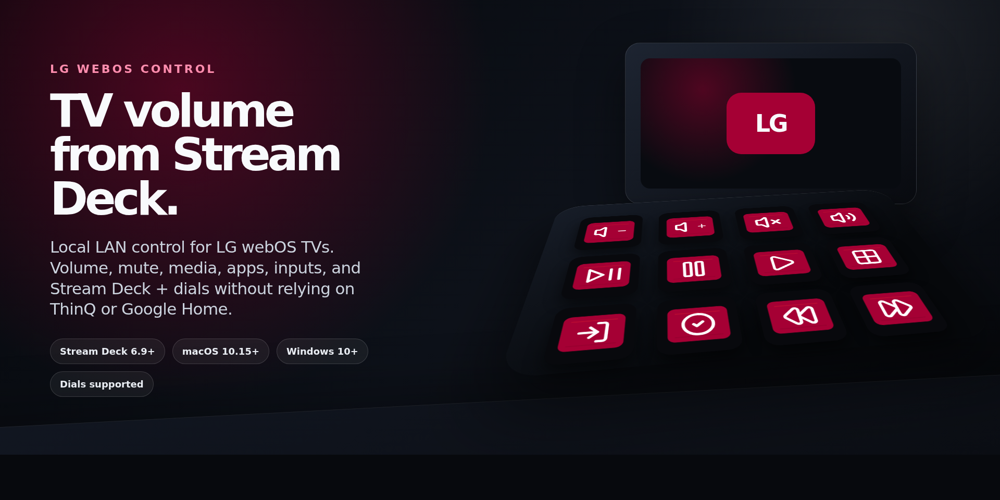
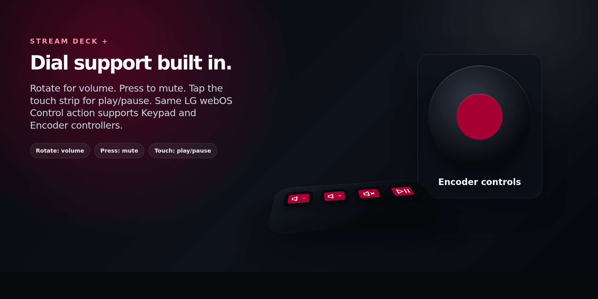
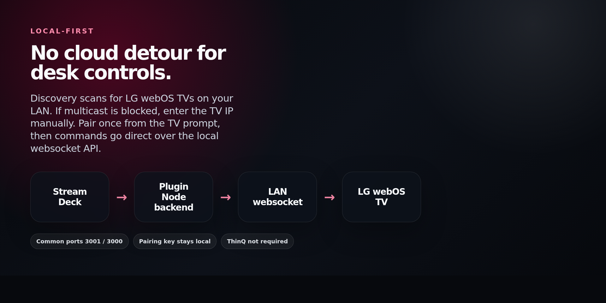
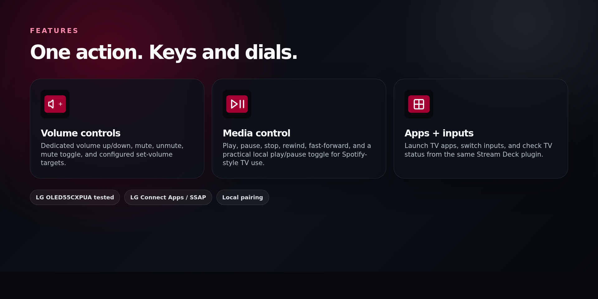

# LG Web OS control for Stream Deck



LG webOS Control is a local-network Stream Deck plugin for controlling LG webOS TVs from your desk. It is built for the everyday case where audio or media is already playing on the TV, such as Spotify Connect in the TV's native Spotify app, and you want reliable volume and playback controls without opening LG ThinQ, routing through Google Home, or reaching for the TV remote.

The plugin talks directly to the TV over LG webOS's local websocket and SSAP API. No cloud relay is required for normal control. The TV and the computer running Stream Deck just need to be on the same LAN or VLAN, with LG Connect Apps enabled on the TV.

## Features

- Volume up and volume down
- Mute, unmute, and mute toggle
- Set volume to a configured target
- Media play, pause, stop, rewind, and fast forward
- Combined play/pause toggle for player apps where LG's native playback state is inconsistent
- Launch TV apps from Stream Deck
- Switch TV inputs from Stream Deck
- TV status action
- Stream Deck + dial support
- Touch strip feedback for dial actions
- Local pairing flow from the Property Inspector
- Pairing keys stay local and are not exported in action settings or profiles

## Stream Deck + dial controls



On Stream Deck +, the same action supports encoder and dial use:

- Rotate clockwise: volume up
- Rotate counter-clockwise: volume down
- Press dial: mute toggle
- Tap touch strip: play/pause toggle

## Device discovery and pairing



The Property Inspector can scan for LG webOS TVs on the local network. You can also enter a TV IP address manually when discovery is blocked by a router, firewall, VLAN, or multicast setting.

On first pairing, the TV displays an approval prompt. Once approved, the plugin stores a local client key for future commands. The plugin commonly connects over webOS websocket ports `3001` or `3000`.

## Compatibility

- Stream Deck app: 6.9 or later
- Stream Deck manifest SDK: version 3
- macOS: 10.15 or later
- Windows: 10 or later
- Controllers: Keypad and Encoder / Stream Deck + dials
- Tested with an LG OLED55CXPUA webOS TV

The plugin is intended for LG webOS TVs that expose the local LG Connect Apps / SSAP websocket control interface. Exact behavior can vary by model, firmware, network layout, and audio setup.

## Install for local testing

1. Install dependencies:

   ```bash
   npm install
   ```

2. Build the Stream Deck plugin package:

   ```bash
   npm run pack
   ```

3. Open the generated installer:

   ```text
   dist/com.leland.lg-webos-control.streamDeckPlugin
   ```

4. Add **LG webOS Control** to a key or dial in Stream Deck.
5. In the Property Inspector, scan for your TV or enter its IP manually.
6. Click **Pair / Re-pair** and approve the prompt on the TV.

## Development

```bash
npm install
npm run check
npm run pack
```

The plugin source lives in:

```text
com.leland.lg-webos-control.sdPlugin/
```

The package is built with the official Elgato CLI through `npm run pack`.

## Screenshots



## Privacy and network behavior

LG webOS Control is local-first. Commands are sent over the local network rather than through LG ThinQ cloud automations, Google Home, or another third-party service. Pairing credentials remain local to the user's machine.

## Notes

The combined play/pause action uses a practical local toggle because some LG webOS app and player combinations report playback state inconsistently. If playback is changed outside Stream Deck, for example from a phone, the TV remote, or Spotify itself, the toggle may need one extra press to resync. Dedicated play and pause buttons remain available for explicit control.

## License

MIT. See [LICENSE](LICENSE).
